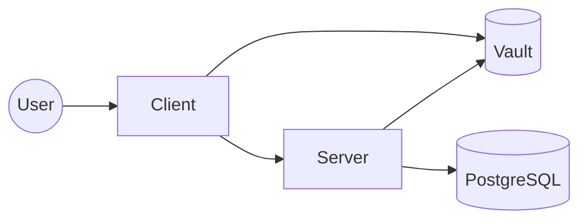

# fhe-db-search

## System Architecture



## Usage
```bash
# docker compose - vault, postgres, migrations, server, client
make run
```

```bash
# cargo run server + client & docker postgres + vault
make run-local
```
