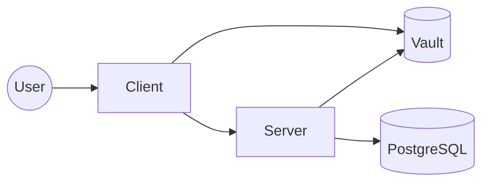

# fhe-db-search

## System Architecture



## Usage
```bash
make
# Available targets:
#   help - Show this help
#   fmt - Format code
#   clean-db - new postgres container with diesel migrations applied
#   bake - Bake docker images
#   kill-local - Kill local server and client processes
#   run-local - Run server and client locally
#   run - Run server and client in docker
#   clean - Clean logs and target directories
```

```bash
# docker compose - vault, postgres, migrations, server, client
make run
```

```bash
# cargo run server + client & docker postgres + vault
make run-local
```
